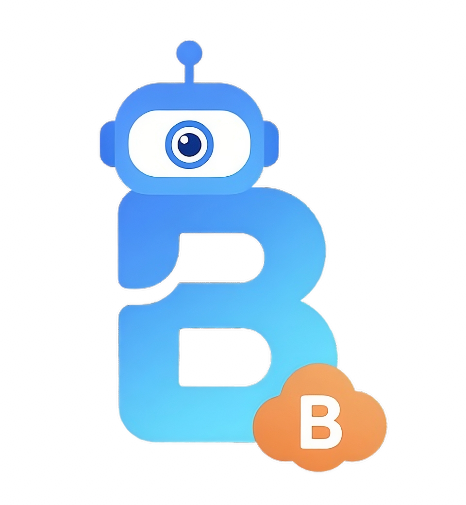

[](https://www.gnu.org/licenses/gpl-3.0)

# BakuBot



BakuBot to bot integrujący Discord, Twitch oraz StreamElements, którego celem jest automatyzacja zarządzania informacjami i komunikacją społeczności streamera.

Projekt pozwala m.in. na zarządzanie planem streamów, automatyczne wysyłanie powiadomień oraz pobieranie wybranych informacji związanych z [Twitch](https://www.twitch.tv), [Steam](https://store.steampowered.com/app/872990/Stream_Games/?l=polish) oraz [Xayo.pl](https://www.xayo.pl/).

---

## Oficjalny projekt

To repozytorium jest oficjalnym repozytorium projektu BakuBot.

Nazwa BakuBot, logo oraz pozostałe elementy brandingu projektu nie są objęte licencją GPL-3.0, chyba że wyraźnie zaznaczono inaczej.

Forki i projekty bazujące na kodzie BakuBota nie powinny być przedstawiane jako oficjalne wersje projektu.

---

## Oficjalna strona

Pełna dokumentacja oraz informacje dotyczące BakuBota:

**[Dokumentacja BakuBot](https://sitefox.gitbook.io/bakubot-1)**

> **Uwaga:** dokumentacja jest obecnie w trakcie aktualizacji.

---

## Najważniejsze funkcje

### Discord
- Zmiana planu bezpośrednio z poziomu Discorda
- Automatyczne powiadomienia na Discordzie
- Automatyczne oznaczanie @everyone
- Informacja o osobie, która zmieniła plan
- Obsługa wielu serwerów Discord
- Obsługa wielu kanałów powiadomień

### Twitch
- Integracja z Twitch
- Wyszukiwanie logów wiadomości użytkowników Twitcha
- Integracja z planem streamera
- Automatyczna synchronizacja informacji

### StreamElements
- Zmiana planu przez StreamElements
- Automatyczne zapisywanie planu
- Automatyczna synchronizacja planu

### Pozostałe
- Informacje o grach ze Steam
- Integracja z Xayoo.pl
- Integracja z Discordem, Twitch i StreamElements

---

## Jak działa BakuBot?

BakuBot łączy kilka usług w jeden system, automatyzując przepływ informacji pomiędzy nimi.

Szczegółowy schemat działania znajduje się tutaj:

**[Schemat działania](assets/Diagram.md)**

---
# Wymagania

Przed instalacją upewnij się, że masz dostęp do wymaganych usług oraz odpowiednich danych uwierzytelniających.

BakuBot wykorzystuje integracje z:
- Discord
- Twitch
- StreamElements
- Steam
  
---

# Instalacja i konfiguracja

Chcesz uruchomić BakuBot na swoim serwerze?

Pełna instrukcja instalacji, konfiguracji oraz wymaganych ustawień znajduje się tutaj:

**[Instalacja i konfiguracja](assets/Guide.md)**


## Wkład w projekt

BakuBot jest projektem open source i zapraszamy do zgłaszania błędów, propozycji oraz tworzenia Pull Requestów.

Przed rozpoczęciem pracy nad kodem zapoznaj się z:

**[CONTRIBUTING.md](CONTRIBUTING.md)**

Problemy związane z bezpieczeństwem należy zgłaszać zgodnie z:

**[SECURITY.md](SECURITY.md)**

---

## Roadmap

Planowany rozwój projektu może obejmować kolejne funkcje oraz usprawnienia integracji z wykorzystywanymi usługami.

Aktualne propozycje i pomysły można zgłaszać w sekcji Issues projektu.

---

## Licencja

BakuBot jest udostępniany na licencji **GNU General Public License v3.0**.

Pełny tekst licencji znajduje się w pliku:

**[LICENSE](LICENSE)**

---

## Copyright

```
Copyright © 2026 sitefox69

BakuBot jest wolnym oprogramowaniem udostępnianym na warunkach licencji GNU General Public License v3.0.
```​​​​​​​​​​​​​​​​​​​​​​​​​​​​​​​​​​​​​​​​​​​​​​​​​​
